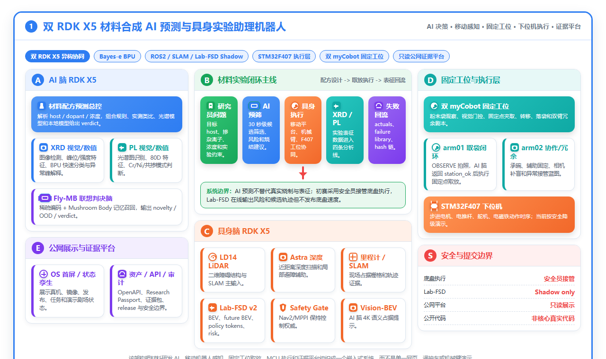
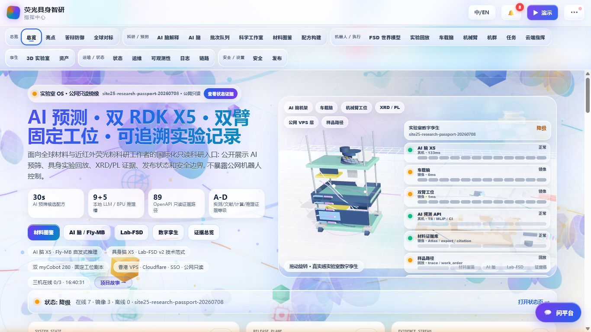

# 基于双 RDK X5 异构协同的材料合成 AI 预测与多机具身实验助理机器人

地瓜机器人赛道 RDK X5 嵌入式竞赛作品。

## 项目简介

本项目面向近红外荧光粉等功能材料研发场景，构建一套嵌入式科研自动化实验助理系统。系统把材料配方预筛、XRD/PL 表征分析、具身执行、固定工位取放、公开证据展示连接成一条可追溯的工程链路。

当前公开仓库是面向评审和 NodeHub 展示的真实项目公开边界，包含系统设计、公开展示站前端、接口 schema、报告图表资产、非核心工位逻辑、边缘接口适配、公开截图、公开晶体缓存和离线演示传感器帧。不公开私有实验数据、模型权重、部署凭据、核心材料预测引擎和可直接控制真实硬件的危险脚本。

## 系统设计

完整系统由四层协同组成：

| 层级 | 主要硬件 | 作用 |
| --- | --- | --- |
| AI 脑 | RDK X5、4K 相机、音频模块 | 材料预测、XRD/PL 分析、本地大模型推理、实验证据记录 |
| 具身脑 | RDK X5、LD14 激光雷达、Astra 深度相机、里程计 | SLAM、障碍感知、Lab-FSD shadow planning、安全门控输出 |
| 固定工位 | 双 myCobot 280-Pi、末端相机、自研夹爪 | 工位视觉确认、粉末袋夹取转移、单臂冗余接管 |
| 执行层 | STM32F407、舵机、电推杆、电磁铁、步进轴 | 底层动作时序、瓶子吸附/释放、安全降级执行流程 |

初赛演示把真实硬件动作限制在明确安全边界内：底盘由安全员接管，SLAM、LiDAR、深度扫描、Lab-FSD shadow 规划、风险输出和候选轨迹在线运行；固定工位和 STM32F407 层展示已验证的动作时序和物体取放能力，不暴露无约束硬件控制入口。

## 核心能力

- 双 RDK X5 异构协同：AI 脑负责科研推理，具身脑负责移动感知和规划。
- 四条 AI 分析线：视觉线、XRD 数值线、光谱视觉线和光谱数值线。
- 本地嵌入式推理边界：BPU 轻量模型、CPU 本地大模型进程和离线降级路径。
- Lab-FSD shadow planner：借鉴 BEV occupancy 思路输出风险、候选轨迹和安全门控，初赛阶段不直接接管底盘。
- 固定工位取放：RDK X5 做视觉判决，树莓派机械臂端做运动执行，自研末端执行器适配实验材料。
- STM32F407 动作时序：舵机、电推杆、电磁铁和步进轴在安全降级策略下完成末端执行演示。
- 公网证据平台：静态前端、接口 schema、报告图表、渲染页、截图和可复核资料统一组织。

## 仓库结构

| 路径 | 内容 |
| --- | --- |
| `public_site_static/` | 公网证据展示站静态前端、PWA 和 3D 晶体展示资产 |
| `public_site_reports/` | 只读公开状态报告样例 |
| `public_site_tools/` | 公开 3D 晶体资产生成脚本 |
| `workstation_public/` | 非核心工位互锁、mock 遥测、技能回放和图标工具 |
| `workstation_frontend_public/` | 公开工位 UI 组件、图表、3D 机械臂场景、状态 store 和页面 |
| `edge_public/` | Lab-FSD shadow、Fly-MB 判决和 F407 时序的公开接口桩 |
| `schemas/` | 只读状态 API schema 和示例响应 |
| `report_source/` | TeX 报告源码、HTML 图表源码、MATLAB/Python 图表脚本和生成图 |
| `public_evidence_data/` | 公开截图、报告渲染页、公开晶体缓存和离线演示传感器帧 |
| `docs/` | 公开项目地图和公开边界说明 |

## 公开证据

仓库内提供不需要私有凭据即可检查的公开证据：

- `public_evidence_data/report_rendered_pages/`：19 页报告渲染图。
- `public_evidence_data/site_screenshots/`：公网展示站截图。
- `public_evidence_data/crystal_public_cache/`：公开晶体结构缓存。
- `public_evidence_data/demo_sensor_frames/`：离线演示传感器帧。
- `report_source/generated_figures/`：由 HTML、MATLAB 和 Python 生成的报告图。

## 如何查看

该公开仓库用于设计展示和评审复核，不用于直接部署到真实机器人。

1. 打开 `public_site_static/index.html` 查看静态证据站界面。
2. 阅读 `report_source/main.tex` 和 `report_source/sections/` 查看完整设计报告源码。
3. 查看 `schemas/openapi_status_schema.json` 和 `schemas/status_snapshot_example.json` 理解公开状态接口结构。
4. 查看 `workstation_public/` 和 `edge_public/` 理解非核心逻辑与接口边界。
5. 使用 `public_evidence_data/` 下的渲染页和截图进行离线复核。

## NodeHub 填写草稿

- 项目名称：基于双 RDK X5 异构协同的材料合成 AI 预测与多机具身实验助理机器人
- 项目简介：面向材料研发场景的双 RDK X5 嵌入式科研自动化系统，集成材料预测、XRD/PL 分析、SLAM 与 Lab-FSD shadow 规划、固定工位取放、STM32F407 执行层和公网证据平台。
- 代码仓库：`https://github.com/Xiaomiju-x/xrd`
- 建议标签：RDK X5、嵌入式 AI、材料智能、实验室机器人、SLAM、BPU、STM32F407
- 建议运行平台：RDK X5
- 建议分类：机器人应用、具身智能、AI 视觉、科研自动化
- 视频链接：待 Bilibili 发布后填写嵌入代码。

## 开源边界与协议

公开仓库按 Apache-2.0 的非核心公开边界准备，用于设计展示和评审复核。以下内容不公开：

- API Key、Cookie、SSH/WiFi/SSO 配置、账号凭据和内网地址。
- GGUF、LoRA、BPU bin、tokenizer、tensor 包等模型权重。
- 未公开 XRD/PL 原始数据、私有实验记录、failure-pattern 规则库和完整训练集。
- 核心材料预测引擎、私有规则库、部署脚本和可直接控制真实硬件的执行脚本。

详细边界见 `docs/PUBLIC_BOUNDARY.md`。
